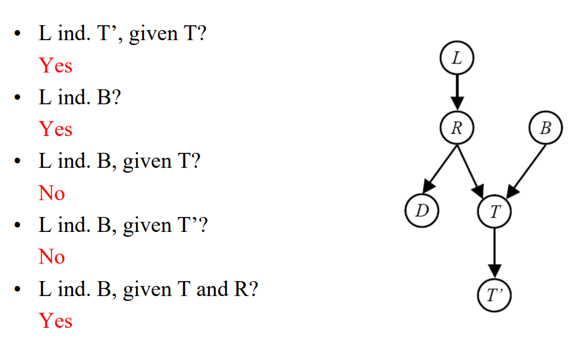
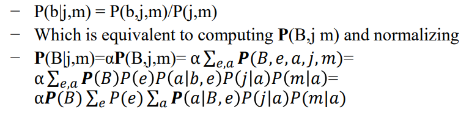
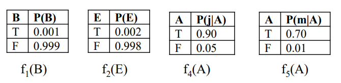
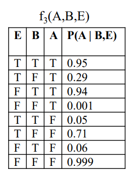
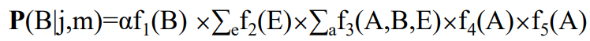
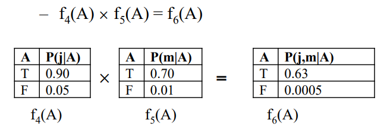
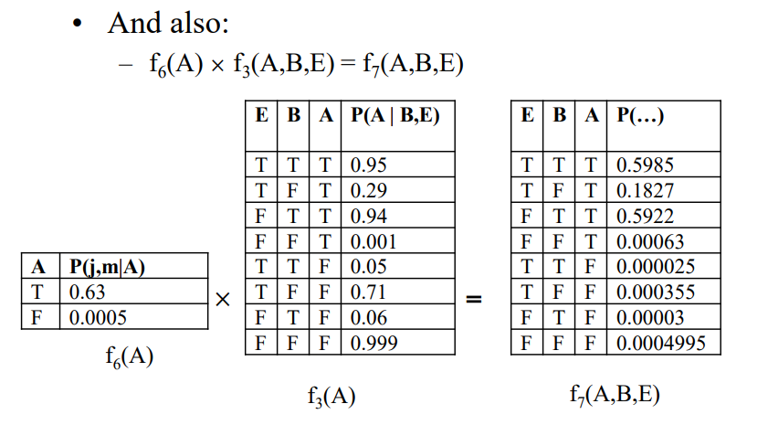
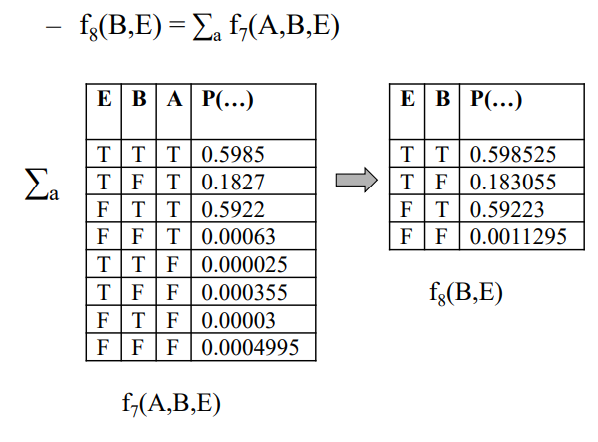
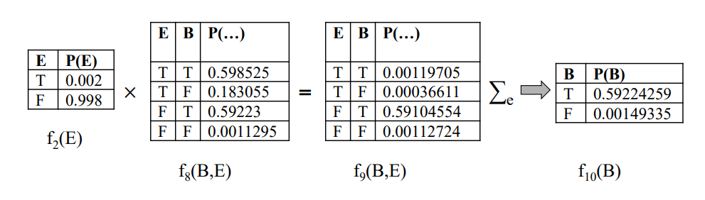
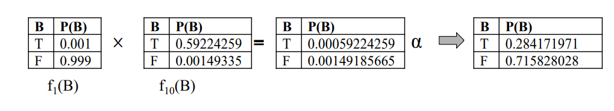

# Algorithms in Artificial Intelligence Course Final Project

### Implementing bayesian network structure with bayes ball and variable elimination algorithms.

## What is a Bayesian Network?

A Bayesian network (also known as a Bayes network, Bayes net, belief network, or decision network) is a probabilistic graphical model that represents a set of variables and their conditional dependencies via a directed acyclic graph (DAG).

## What is the purpose of Bayesian Networks?

Bayesian networks are ideal for taking an event that occurred and predicting the likelihood that any one of several possible known causes was the contributing factor. For example, a Bayesian network could represent the probabilistic relationships between diseases and symptoms. Given symptoms, the network can be used to compute the probabilities of the presence of various diseases.

* [taken from wikipedia](https://en.wikipedia.org/wiki/Bayesian_network)

## <i> Bayes Ball Algorithm </i>

### Algorithm Purpose:

To determine if two variables in the model graph are independent given other variables as evidence, the given conditional statement shown as ```Xa q Xb | Xc```  when we ask the algorithm if ```Xa``` and ```Xb``` are independents given ```Xc``` as evidence.

### Algorithm Pseudo-Code:

```
1. Shade all the evidence nodes (Xc)

2. Start at the soruce node (Xa)

3. Search for the destination node (Xb) - (in this project I've used BFS algorithm)

4. If we can't reach from the source node to the destination node then nodes Xa and Xb (represents as variables) must be conditionaly independent.

5. Else - there is a valid path between Xa and Xb nodes, then they must be conditionally dependent.
```

### Algorithm Example:



### Algorithm Source:

[Article of Ross D. Shachter who created this algorithm](https://arxiv.org/ftp/arxiv/papers/1301/1301.7412.pdf)


## <i> Variable Elimination Algorithm </i>

### Algorithm Purpose:

Variable elimination (VE) is a simple and general exact inference algorithm in probabilistic graphical models, such as Bayesian networks and Markov random fields. It can be used for inference of maximum a posteriori (MAP) state or estimation of conditional or marginal distributions over a subset of variables.

* [taken from wikipedia](https://en.wikipedia.org/wiki/Variable_elimination)


### Algorithm complexity:

The algorithm has exponential time complexity, but could be efficient in practice for the low-treewidth graphs, if the proper elimination order is used.

### Algorithm Pseudo-Code:

The form of the query that the algorithm get is: P(Q=q|E1=e1,...,Ek=ek) H1-...-Hm,
when Q is the variable we want to calculate his probability when he equal to q,
E1,...,Ek are the evidence variables that we know their outcomes e1,...,ek in the query
and H1-...-Hm are the variable we want to eliminate throw the algorithm in that order (first H1, then H2... and at last Hm).
```
1. Start with initial factors for each relevant variable to the query (if Q and the other variable are dependent given the query evidence variables - using Bayes Ball as above).
2. Update for each local CPTs the evidence variable values - kip only the outcomes values (e1,...,ek) for each evidence variable.
3. If an instantiated CPT becomes one-valued, discard the factor
4. While there are still hidden variables (H1,...,Hm):
   1. Pick a hidden variable H
   2. Join all factors mentioning H
   3. Eliminate (sum out) H
   4. If the factor becomes one-valued, discard the factor
5. Join all remaining factors
6. Normalize the last factor
7. Return the probability of Q=q from the last factor
```

### Join, Eliminate and Normalize:

1. <b>Join:</b><br>take all the relevant factors over the joining variable and build a new factor over the union of the variables (the implementation of this operation is to take each time only two factors and join them to one factor, remove the two factors from the join factors list and add the joined factor, continue the process until we get only one factor).
2. <b>Eliminate:</b><br>take a factor and sum out a variable - marginalization and shrinks a factor to a smaller one by the variable value.
3. <b>Normalize</b><br>take each probability in the last factor and divide it with the sum of all the probabilities in the factor.

### Algorithm Example:

<b>In our example, we want to compute:</b>


<b>Our relevant factors CPTs are:</b>




<b>And we can write:</b>


<b>Join A:</b>





<b>Eliminate A:</b>


<b>Join and Eliminate A:</b>


<b>Join B and Normalize:</b>


Now we got that the probability of B=T is 0.284171971
